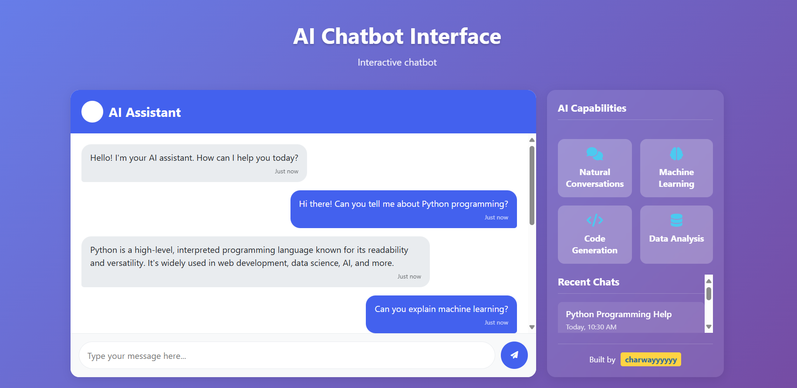

# AI Chatbot Interface

A responsive web-based interface for interacting with AI chatbots. This project features a clean UI, chat history, and sidebar features, making it easy to integrate with any AI backend.

## Features

- **Beautiful, modern UI** with responsive design
- **Chat window** for real-time conversation
- **Sidebar** with features and chat history
- **Typing indicator** for bot responses
- **Customizable color themes** using CSS variables
- **Animations** for smooth user experience

## Technologies Used

- **HTML5**
- **CSS3** (with custom properties and animations)
- **JavaScript** (for chat logic and interactivity)

## Getting Started

1. **Clone the repository:**
   ```sh
   git clone <your-repo-url>
   ```
2. **Open the project folder:**
   Navigate to the project directory and open `index.html` in your browser.

## File Structure

- `index.html` – Main HTML file
- `style.css` – Stylesheet for layout and design
- `script.js` – JavaScript for chat functionality

## Customization

- Update the color scheme in `style.css` by modifying the `:root` variables.
- Add or modify features in the sidebar by editing the HTML and CSS.
- Integrate with your AI backend by updating the JavaScript logic in `script.js`.

## Screenshots


